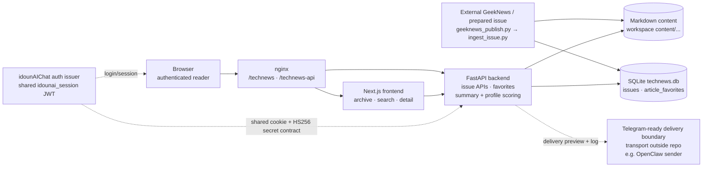

# Personal Tech Radar

**프로필 기반 GeekNews 아카이브, 중요도 평가, 검색, 전송 준비 레이어**

Personal Tech Radar는 GeekNews 기반 일일 다이제스트를 저장하고 평가하며
웹으로 제공하는 계층입니다. 준비된 Markdown 이슈를 받아 SQLite에 이슈
메타데이터와 기사 신호를 저장하고, 원문 Markdown은 콘텐츠로 보존하며,
FastAPI 백엔드와 `/technews` 경로의 Next.js 리더 UI로 아카이브를 제공합니다.

이 저장소가 소유하는 범위는 퍼블리싱 경계와 전송 판단 데이터입니다. 원천
크롤러·요약기와 최종 Telegram 또는 OpenClaw 전송은 외부 연동으로 남겨 둡니다.

[English README](README.md) · [아키텍처 다이어그램 소스](docs/architecture.mmd)

## 핵심 아이디어

- `geeknews_publish.py`와 `ingest_issue.py`를 통한 준비된 Markdown 수집
- 관심사·프로젝트 프로필 매칭과 확인 가능한 fallback 점수 계산
- 구조화 요약, 레이더 카테고리/상태, 점수 근거 제공
- Markdown 기반 상세 화면과 SQLite 메타데이터·기사 즐겨찾기
- FastAPI 기반 아카이브, 검색, 최신 이슈, 상세 API
- 월별 아카이브, 검색, 점수, 태그, 즐겨찾기를 제공하는 Next.js UI
- 외부 sender가 사용할 수 있는 Telegram용 preview 및 delivery-log API
- 인증된 리더를 위한 `idounAIChat` 세션 쿠키 공유 계약

## 이 프로젝트가 필요한 이유

기술 피드는 모으기는 쉽지만 개인에게 의미 있는 신호로 정리하기는 어렵습니다.
Personal Tech Radar는 각 단계를 확인할 수 있도록 분리합니다.

1. 외부 프로세스가 Markdown 이슈를 준비합니다.
2. 이 저장소가 이슈를 영속 콘텐츠와 메타데이터로 정규화합니다.
3. 저장소의 프로필이 관심사, 프로젝트, 매칭 키워드를 제공합니다.
4. 보수적인 scorer가 기사가 중요한 이유와 다음 행동을 설명합니다.
5. 웹 UI가 아카이브를 읽고 검색할 수 있게 합니다.
6. 별도 sender가 평가나 저장 로직을 소유하지 않고 delivery preview를 재사용할
   수 있습니다.

이 프로젝트는 크롤러, LLM 요약기, Telegram bot이 아니라 퍼블리싱 및 의사결정
지원 서비스에 초점을 둡니다.

## 아키텍처

전체 경로는 의도적으로 작게 유지했습니다. 실선은 주요 데이터 경로를,
점선은 이 저장소가 구현하지 않는 외부 계약 또는 경계를 나타냅니다.



독립적으로 렌더링할 수 있는 Mermaid 소스는
[docs/architecture.mmd](docs/architecture.mmd)에 있습니다.

### 실행 흐름

1. 준비된 GeekNews 이슈가 CLI publisher 또는 인증된
   `POST /api/issues/ingest`로 들어옵니다.
2. ingestion 경계가 설정된 content root에 Markdown을 쓰고 설정된 SQLite
   데이터베이스의 이슈 행을 upsert합니다.
3. 구조화 요약이나 점수가 없으면 안전한 fallback 값을 채웁니다. upstream이
   명시한 값은 보존합니다.
4. FastAPI 백엔드가 SQLite의 메타데이터와 Markdown의 기사 콘텐츠를 읽어
   아카이브, 검색, 상세, 즐겨찾기, delivery 기능을 제공합니다.
5. Next.js 프런트엔드가 백엔드를 호출하고 `/technews` base path 아래에서
   아카이브를 렌더링합니다.
6. 인증된 이슈·즐겨찾기 요청은 형제 서비스인 `idounAIChat`가 발급한
   `idounai_session` 쿠키를 사용합니다. 백엔드는 요청마다 auth 서비스에
   호출하지 않고 공유 JWT 계약을 로컬에서 검증합니다.
7. Telegram/OpenClaw sender는 포맷된 preview를 요청하고 전송 결과를 기록할
   수 있습니다. 실제 outbound 메시지 전송은 이 저장소에서 실행되지 않습니다.

## 주요 설계 결정

- **Upstream 경계를 명확히 둡니다.** 이 저장소는 준비된 Markdown을 받으며,
  crawler·feed fetching·LLM summarization은 이 코드베이스 밖에 둡니다.
- **콘텐츠와 메타데이터의 역할을 나눕니다.** Markdown은 읽는 사람이 보는
  이슈를 보존하고, SQLite는 그룹화·검색 메타데이터·점수·즐겨찾기·전송 상태를
  담당합니다.
- **Fallback으로 오래된 이슈를 보존합니다.** 예전 plain-text summary와
  구조화 점수가 없는 레거시 행도 정규화된 fallback 값으로 계속 읽습니다.
- **점수를 설명 가능하게 유지합니다.** 현재 scorer는 프로필 키워드,
  카테고리, 태그, action item, 커뮤니티 신호를 사용합니다. 불투명한 LLM
  judge가 아니라 보수적인 휴리스틱입니다.
- **인증 소유자는 하나입니다.** `idounAIChat`가 공유 세션 쿠키를 발급하고,
  이 서비스는 리더·즐겨찾기 API에 대해 이를 검증합니다. 별도 로그인 시스템을
  중복으로 유지하지 않습니다.
- **Delivery와 transport를 분리합니다.** 이 저장소는 전송 후보를 판단하고
  메시지를 포맷하며, Telegram/OpenClaw 전송과 채널 재시도는 외부 sender의
  책임입니다.
- **작은 서비스가 자체적으로 시작되도록 합니다.** 백엔드는 시작 시 현재
  테이블과 호환 컬럼을 확인하고, 데이터베이스가 비어 있을 때만 샘플 이슈를
  넣습니다. 아직 migration framework는 포함하지 않습니다.

## 제공 기능

- **아카이브:** 연·월별 이슈 그룹, 이슈 날짜순 정렬
- **검색:** 이슈 메타데이터와 Markdown 본문을 검색하고 일치 이슈를 순위화
- **이슈 상세:** 기사 카드, 원문 링크, GeekNews 링크, 구조화 요약, 레이더
  상태, 점수 breakdown, 커뮤니티 반응 표시
- **기사 즐겨찾기:** 인증된 사용자가 이슈별 stable article key를 추가·삭제
- **레이더 점수:** interest, project, novelty, actionability, credibility,
  community, final score, reason, recommended action
- **전송 준비:** threshold 판단, Telegram 포맷 preview, 이슈 레코드에 delivery
  log 기록
- **상태 확인:** `/health`와 `/openapi.json`으로 로컬 및 서비스 smoke check

## 데모

### 준비된 이슈 수집

저장소 루트에서 실행합니다.

```bash
cat article.md | python scripts/geeknews_publish.py
```

CLI는 준비된 Markdown에서 이슈 envelope를 만들고 백엔드와 동일한
`DATABASE_URL`, `CONTENT_ROOT`, 프로필 설정을 사용합니다. JSON을 직접 넣을
때는 `scripts/ingest_issue.py`가 stdin의 JSON을 받습니다.

### 서비스 확인

```bash
curl http://127.0.0.1:8010/health
curl http://127.0.0.1:8010/openapi.json
```

아카이브와 이슈 API는 유효한 공유 auth cookie가 필요합니다. 따라서 로컬 UI를
완전히 사용하려면 프런트엔드 개발 매핑이 사용하는 로컬 포트
(`127.0.0.1:8000`)에서 형제 `idounAIChat` auth 서비스도 실행해야 합니다.

### Delivery preview

이슈가 저장된 뒤 외부 sender는 다음 API를 사용할 수 있습니다.

```text
GET  /api/issues/{slug}/delivery-preview
POST /api/issues/{slug}/delivery-log
```

Preview는 `final_score` threshold를 적용하고 포맷된 메시지 본문을 반환합니다.
Log API는 sender 결과를 이슈 레코드에 기록할 뿐 Telegram 메시지를 직접 보내지는
않습니다.

## 로컬 실행

### Backend

```bash
cd backend
python3 -m venv .venv
source .venv/bin/activate
pip install -r requirements.txt
uvicorn app.main:app --reload --host 127.0.0.1 --port 8010
```

### Frontend

저장소의 프런트엔드-백엔드 로컬 매핑을 사용하려면 포트 `3012`로 실행합니다.

```bash
cd frontend
npm install
npm run dev -- --hostname 127.0.0.1 --port 3012
```

[http://127.0.0.1:3012/technews/](http://127.0.0.1:3012/technews/)에서 엽니다.

이 포트에서 프런트엔드는 이슈 API를 `http://127.0.0.1:8010`으로 호출합니다.
Auth 요청은 로컬 `idounAIChat` 서비스의 `8000` 포트로 매핑되며, production에서는
nginx와 공유 쿠키 계약이 같은 역할을 합니다.

## 설정

Backend 설정은 `backend/.env` 또는 프로세스 환경 변수에서 읽습니다.

- `APP_NAME`, `APP_ENV`
- `DATABASE_URL` — SQLite URL, 기본값은 프로젝트 루트의 `technews.db`
- `CONTENT_ROOT` — Markdown root, 기본값은 workspace 수준의 `content/`
- `INGEST_TOKEN` — `POST /api/issues/ingest`에 필요한 토큰
- `AUTH_SECRET_KEY` — `idounAIChat`와 공유하는 JWT 검증 secret
- `AUTH_COOKIE_NAME` — 기본값 `idounai_session`
- `TECH_RADAR_PROFILE_PATH` — 선택적인 YAML 프로필 경로 override
- `TECH_RADAR_MIN_TELEGRAM_SCORE` — 기본값 `7.0`
- `TECH_RADAR_IMPORTANT_SCORE` — 기본값 `8.5`

프런트엔드는 선택적으로 `NEXT_PUBLIC_API_BASE_URL`을 받습니다. 값이 없으면
위의 로컬 매핑을 사용하거나 nginx 환경에서 same-origin
`/technews-api`를 사용합니다.

### 프로필 설정

저장소에 포함된 샘플 프로필은
[config/tech-radar-profile.yaml](config/tech-radar-profile.yaml)입니다.

```yaml
profile:
  interests:
    - AI Systems
    - Developer Tools
    - ML Infrastructure
  projects:
    - name: Workflow Automation Platform
      description: Multi-step agent and workflow orchestration backend
      keywords:
        - workflow orchestration
        - execution graph
```

설정 파일이 없거나 잘못된 형식이면 backend는 기본 interests와 projects로
fallback합니다. 개인 취향처럼 민감할 수 있는 내용은 저장소 밖의 private
profile에 보관합니다.

## Ingestion 계약

`scripts/ingest_issue.py`와 `POST /api/issues/ingest`는 같은 핵심 payload를
받습니다.

- 필수: `issue_date`, `title`, `summary`, `markdown`
- 선택 구조화 요약: `short_summary`, `impact_summary`, `action_items`,
  `tags`, `radar_category`, `radar_status`
- 선택 점수: `interest_score`, `project_score`, `novelty_score`,
  `actionability_score`, `credibility_score`, `community_score`, `final_score`,
  `score_reason`, `recommended_action`
- 선택: `community_reaction_summary`, `community_reaction_bullets`, `slug`

직접 실행하는 CLI와 API는 항상 같은 database와 content root를 사용해야 합니다.
다르면 publisher가 쓴 이슈와 API가 읽는 이슈 저장소가 달라질 수 있습니다.

## API

- `GET /api/issues` — 인증된 아카이브 그룹
- `GET /api/issues/latest` — 인증된 최신 이슈
- `GET /api/issues/search?q=keyword` — 인증된 메타데이터/본문 검색
- `GET /api/issues/{slug}` — 인증된 이슈 상세
- `GET /api/issues/{slug}/delivery-preview` — 전송 준비 preview
- `POST /api/issues/{slug}/delivery-log` — 외부 전송 결과 기록
- `GET/POST/DELETE /api/issues/article-favorites` — 인증된 즐겨찾기
- `POST /api/issues/ingest` — token-protected 이슈 upsert

## 로컬 검증

```bash
cd backend
source .venv/bin/activate
pytest

cd ../frontend
npx tsc --noEmit
npm run build
```

저장소 루트에서 `git diff --check`도 문서 변경을 공유하기 전에 유용합니다.

## 운영

현재 user-service 배포 구조는
[deploy/README.md](deploy/README.md)에 정리되어 있습니다. 다음 helper로 두
서비스 프로세스를 재시작하고 smoke check할 수 있습니다.

```bash
./scripts/restart_backend.sh
./scripts/restart_frontend.sh
```

Production 라우팅은 다음과 같습니다.

- `/technews/` → `127.0.0.1:3012`의 Next.js
- `/technews-api/` → `127.0.0.1:8010`의 FastAPI

프런트엔드 production build는 `.next-prod`를 사용하며, 배포 helper가 정적
asset을 `/var/www/technews-next-static`에 게시합니다.

## 현재 한계

- GeekNews crawling, feed fetching, LLM summarization은 포함하지 않으며
  준비된 Markdown을 요구합니다.
- Telegram 및 OpenClaw outbound transport, retry, channel credential는
  이 저장소에 구현되어 있지 않습니다.
- Scorer는 프로필 기반 heuristic입니다. 설명 가능하지만 semantic LLM
  evaluator는 아닙니다.
- Delivery preview/log route에는 현재 별도의 sender 인증 dependency가
  없습니다. 신뢰할 수 없는 클라이언트에 노출하기 전에 배포 경계에서
  보호해야 합니다.
- 리더와 즐겨찾기 인증은 공유 `idounAIChat` session issuer와 secret 계약에
  의존하므로 이 저장소만으로 로그인할 수 없습니다.
- 검색은 full-text index 대신 메타데이터와 Markdown을 스캔합니다.
- 현재 단일 서비스 형태에는 SQLite와 startup compatibility check로 충분하지만,
  애플리케이션 내부에 migration/backup 자동화는 없습니다.
- 기본 content root가 프로젝트 디렉터리 밖에 있으므로 백업 시 저장소와 설정된
  runtime data path를 모두 보존해야 합니다.

## 프로젝트 구조

```text
technews-publisher/
├── backend/
│   └── app/                 # FastAPI, SQLAlchemy 모델, scoring, delivery
├── config/                  # 저장소에 포함된 샘플 radar profile
├── docs/
│   ├── architecture.mmd     # 독립 Mermaid 아키텍처 소스
│   ├── scoring-notes.md
│   ├── search-notes.md
│   └── session-timeout-design.md
├── frontend/                # /technews 아래의 Next.js reader
├── scripts/                 # 준비 이슈 및 서비스 helper
├── deploy/                  # nginx/systemd 배포 문서
├── BACKUP_RESTORE.md
├── README.md
└── README.ko.md
```

## 문서

- [Architecture source](docs/architecture.mmd) — 시스템 컴포넌트와 경계
- [Repository analysis](docs/repo-analysis.md) — 구현 목록과 과거 데이터 흐름
- [Scoring notes](docs/scoring-notes.md) — 프로필 매칭과 가중 점수 동작
- [Search notes](docs/search-notes.md) — 메타데이터/본문 검색 동작
- [Session timeout design](docs/session-timeout-design.md) — 공유 auth 경계
- [Deployment notes](deploy/README.md) — nginx, systemd, 포트, smoke check
- [Backup and restore](BACKUP_RESTORE.md) — runtime 데이터 복구 체크리스트
