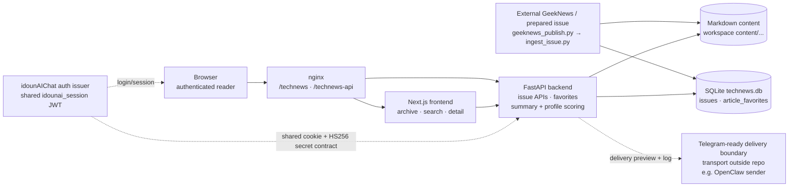

# Personal Tech Radar

**A profile-driven GeekNews archive for scoring, search, and delivery-ready reading.**

Personal Tech Radar is the storage, scoring, and web publishing layer for a
GeekNews-based daily digest. It turns prepared markdown issues into a searchable
archive: issue metadata and article signals are stored in SQLite, full markdown
is kept as content, and a FastAPI backend serves a Next.js reader under
`/technews`.

The repository owns the publishing boundary and delivery decision data. The
upstream crawler/summarizer and the final Telegram or OpenClaw transport remain
external integrations.

[한국어 README](README.ko.md) · [Architecture diagram source](docs/architecture.mmd)

## Key ideas

- Prepared-markdown ingestion through `geeknews_publish.py` and
  `ingest_issue.py`
- Profile-driven interest/project matching with transparent fallback scoring
- Structured summaries, radar categories/statuses, and score explanations
- Markdown-backed issue detail with SQLite metadata and article favorites
- Archive, search, latest issue, and detail APIs behind a FastAPI service
- Next.js reader UI with month grouping, search, scores, tags, and favorites
- Telegram-ready preview and delivery-log endpoints for an external sender
- Shared `idounAIChat` session-cookie contract for authenticated readers

## Why this project

Daily technical feeds are easy to collect and hard to turn into a useful
personal signal. Personal Tech Radar keeps the stages inspectable:

1. An external process prepares an issue in markdown.
2. The repository normalizes the issue into durable content and metadata.
3. A checked-in profile supplies interests, projects, and matching keywords.
4. A conservative scorer explains why an article matters and what to do next.
5. The web UI makes the archive readable and searchable.
6. A separate sender can reuse the delivery preview without owning scoring or
   storage logic.

This is a focused publishing and decision-support service, not a crawler,
LLM summarizer, or Telegram bot.

## Architecture

The high-level path is intentionally small. Solid arrows show the main data
path; dotted arrows show an external contract or a boundary that this
repository does not implement.



The standalone Mermaid source is available at
[docs/architecture.mmd](docs/architecture.mmd).

### Execution flow

1. A prepared GeekNews issue enters through the CLI publisher or the protected
   `POST /api/issues/ingest` endpoint.
2. The ingestion boundary writes markdown under the configured content root
   and upserts the issue row in the configured SQLite database.
3. Missing structured summaries and scores are filled with safe fallback
   values. Explicit values supplied by the upstream process are preserved.
4. The FastAPI backend reads metadata from SQLite and article content from
   markdown, then exposes archive, search, detail, favorite, and delivery
   operations.
5. The Next.js frontend calls the backend and renders the archive under the
   `/technews` base path.
6. Authenticated issue and favorite requests use the `idounai_session` cookie
   issued by the sibling `idounAIChat` service. The backend validates the
   shared JWT contract locally; it does not call the auth service per request.
7. A Telegram/OpenClaw sender may request a formatted preview and report a
   delivery result. No outbound message transport runs in this repository.

## Key design decisions

- **The upstream boundary is explicit.** The repository receives prepared
  markdown; crawler, feed fetching, and LLM summarization are intentionally
  outside this codebase.
- **Content and metadata have different jobs.** Markdown preserves the
  reader-facing issue, while SQLite supports grouping, search metadata,
  scores, favorites, and delivery state.
- **Fallbacks preserve old issues.** Legacy plain-text summaries and rows that
  predate structured scoring continue to load through normalized fallback
  values.
- **Scoring is explainable.** The current scorer uses profile keywords,
  categories, tags, action items, and community signals. It is a conservative
  heuristic, not an opaque LLM judge.
- **Authentication has one owner.** `idounAIChat` issues the shared session
  cookie; this service verifies it for reader and favorite APIs rather than
  maintaining a second login system.
- **Delivery is separated from transport.** The repository decides and formats
  a candidate message, while Telegram/OpenClaw delivery and channel retries
  belong to an external sender.
- **Startup keeps the small service self-contained.** The backend ensures the
  current tables and compatibility columns exist at startup and seeds a sample
  issue only when the database is empty. A migration framework is not included
  yet.

## Product surface

- **Archive:** issues grouped by year and month, ordered by issue date.
- **Search:** scans issue metadata and markdown text, then ranks matching
  issues for the reader.
- **Issue detail:** renders article cards, original links, GeekNews links,
  structured summary, radar status, score breakdown, and community reaction.
- **Article favorites:** authenticated users can add or remove stable article
  keys per issue.
- **Radar scoring:** interest, project, novelty, actionability, credibility,
  community, final score, reason, and recommended action.
- **Delivery readiness:** threshold decisions, Telegram-formatted preview text,
  and delivery-log recording on the issue record.
- **Health checks:** `/health` and `/openapi.json` support local and service
  smoke checks.

## Demo

### Ingest a prepared issue

From the repository root:

```bash
cat article.md | python scripts/geeknews_publish.py
```

The CLI derives the issue envelope from the prepared markdown and uses the same
`DATABASE_URL`, `CONTENT_ROOT`, and profile settings as the backend. For direct
JSON ingestion, `scripts/ingest_issue.py` accepts JSON on stdin.

### Inspect the service

```bash
curl http://127.0.0.1:8010/health
curl http://127.0.0.1:8010/openapi.json
```

The archive and issue endpoints require a valid shared auth cookie. A complete
local UI therefore also needs the sibling `idounAIChat` auth service on its
configured local port (`127.0.0.1:8000` in the frontend development mapping).

### Preview delivery

After an issue exists, an external sender can use:

```text
GET  /api/issues/{slug}/delivery-preview
POST /api/issues/{slug}/delivery-log
```

The preview applies `final_score` thresholds and returns formatted message
content. The log endpoint records the sender result on the issue record; it
does not send a Telegram message itself.

## Run locally

### Backend

```bash
cd backend
python3 -m venv .venv
source .venv/bin/activate
pip install -r requirements.txt
uvicorn app.main:app --reload --host 127.0.0.1 --port 8010
```

### Frontend

Use port `3012` for the repository's local frontend-to-backend mapping:

```bash
cd frontend
npm install
npm run dev -- --hostname 127.0.0.1 --port 3012
```

Open [http://127.0.0.1:3012/technews/](http://127.0.0.1:3012/technews/).

The frontend uses `http://127.0.0.1:8010` for issue APIs on that port. Its auth
requests are mapped to the local `idounAIChat` service on port `8000`; in
production, nginx and the shared cookie contract provide the equivalent
routing.

## Configuration

Backend settings are read from `backend/.env` or the process environment.

- `APP_NAME`, `APP_ENV`
- `DATABASE_URL` — SQLite URL; defaults to the project-root `technews.db`
- `CONTENT_ROOT` — markdown root; defaults to the workspace-level `content/`
- `INGEST_TOKEN` — required by `POST /api/issues/ingest`
- `AUTH_SECRET_KEY` — JWT verification secret shared with `idounAIChat`
- `AUTH_COOKIE_NAME` — defaults to `idounai_session`
- `TECH_RADAR_PROFILE_PATH` — optional YAML profile override
- `TECH_RADAR_MIN_TELEGRAM_SCORE` — default `7.0`
- `TECH_RADAR_IMPORTANT_SCORE` — default `8.5`

The frontend accepts the optional `NEXT_PUBLIC_API_BASE_URL`. When unset, the
browser uses the local mapping above or same-origin `/technews-api` behind
nginx.

### Profile configuration

The checked-in sample profile is
[config/tech-radar-profile.yaml](config/tech-radar-profile.yaml):

```yaml
profile:
  interests:
    - AI Systems
    - Developer Tools
    - ML Infrastructure
  projects:
    - name: Workflow Automation Platform
      description: Multi-step agent and workflow orchestration backend
      keywords:
        - workflow orchestration
        - execution graph
```

If the configured file is missing or malformed, the backend falls back to its
default interests and projects. Keep a private personal profile outside the
repository when it contains sensitive preferences.

## Ingestion contract

`scripts/ingest_issue.py` and `POST /api/issues/ingest` accept the same core
payload:

- required: `issue_date`, `title`, `summary`, `markdown`
- optional structured summary: `short_summary`, `impact_summary`,
  `action_items`, `tags`, `radar_category`, `radar_status`
- optional scores: `interest_score`, `project_score`, `novelty_score`,
  `actionability_score`, `credibility_score`, `community_score`, `final_score`,
  `score_reason`, `recommended_action`
- optional: `community_reaction_summary`, `community_reaction_bullets`, `slug`

The direct CLI and API paths should always use the same database and content
root. Otherwise the API may read a different issue store from the one the
publisher wrote.

## API

- `GET /api/issues` — authenticated archive groups
- `GET /api/issues/latest` — authenticated latest issue
- `GET /api/issues/search?q=keyword` — authenticated metadata/content search
- `GET /api/issues/{slug}` — authenticated issue detail
- `GET /api/issues/{slug}/delivery-preview` — delivery-ready preview
- `POST /api/issues/{slug}/delivery-log` — record an external send result
- `GET/POST/DELETE /api/issues/article-favorites` — authenticated favorites
- `POST /api/issues/ingest` — token-protected issue upsert

## Verify locally

```bash
cd backend
source .venv/bin/activate
pytest

cd ../frontend
npx tsc --noEmit
npm run build
```

From the repository root, `git diff --check` is also useful before sharing a
documentation change.

## Operations

For the current user-service deployment shape, see
[deploy/README.md](deploy/README.md). The helper scripts cover the two local
service processes:

```bash
./scripts/restart_backend.sh
./scripts/restart_frontend.sh
```

Production-style routing is:

- `/technews/` → Next.js on `127.0.0.1:3012`
- `/technews-api/` → FastAPI on `127.0.0.1:8010`

The frontend production build uses `.next-prod`; static assets are published
to `/var/www/technews-next-static` by the deployment helper.

## Current limitations

- GeekNews crawling, feed fetching, and LLM summarization are not included;
  the repository expects prepared markdown.
- Telegram and OpenClaw outbound transport, retries, and channel credentials
  are not implemented here.
- The scorer is profile-based heuristic logic. It is explainable but not a
  semantic LLM evaluator.
- The delivery preview/log routes currently have no separate sender
  authentication dependency; protect them at the deployment boundary before
  exposing them to untrusted clients.
- Reader and favorite authentication depends on the shared `idounAIChat`
  session issuer and secret contract; this repository is not standalone for
  login.
- Search scans metadata and markdown rather than using a full-text index.
- SQLite and startup table compatibility checks are sufficient for the current
  single-service shape, but there is no migration/backup automation in the
  application itself.
- The default content root is outside the project directory, so backups must
  preserve both the repository and its configured runtime data paths.

## Project structure

```text
technews-publisher/
├── backend/
│   └── app/                 # FastAPI, SQLAlchemy models, scoring, delivery
├── config/                  # Checked-in sample radar profile
├── docs/
│   ├── architecture.mmd     # Standalone Mermaid architecture source
│   ├── scoring-notes.md
│   ├── search-notes.md
│   └── session-timeout-design.md
├── frontend/                # Next.js reader under /technews
├── scripts/                 # Prepared-issue and service helpers
├── deploy/                  # nginx/systemd deployment notes
├── BACKUP_RESTORE.md
├── README.md
└── README.ko.md
```

## Documentation

- [Architecture source](docs/architecture.mmd) — system components and
  boundaries
- [Repository analysis](docs/repo-analysis.md) — implementation inventory and
  historical data flow
- [Scoring notes](docs/scoring-notes.md) — profile matching and weighted score
  behavior
- [Search notes](docs/search-notes.md) — metadata/content search behavior
- [Session timeout design](docs/session-timeout-design.md) — shared auth
  boundary notes
- [Deployment notes](deploy/README.md) — nginx, systemd, ports, and smoke checks
- [Backup and restore](BACKUP_RESTORE.md) — runtime data recovery checklist
